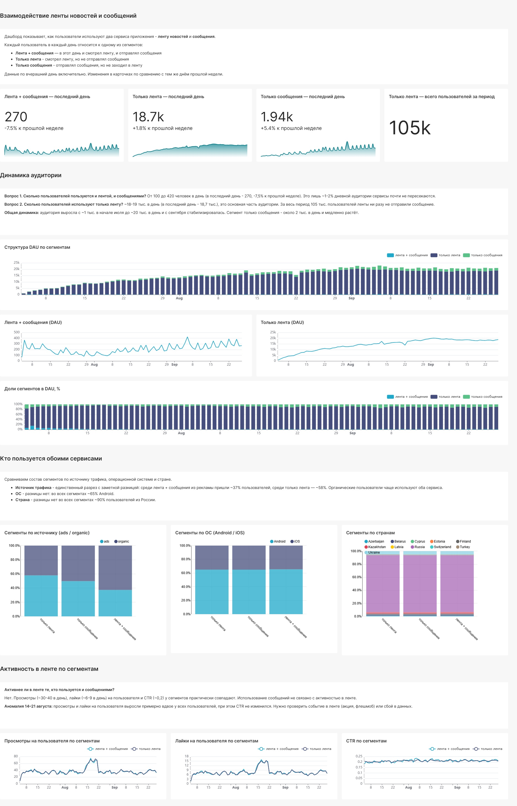

# Взаимодействие ленты новостей и сообщений — дашборд в Apache Superset

Аналитический дашборд для социального приложения с двумя сервисами — **лентой новостей** и **мессенджером**. Проект выполнен в рамках симулятора аналитика karpov.courses.



## Задача

Построить дашборд, который описывает взаимодействие двух продуктов и отвечает на вопросы:

1. Какая у приложения активная аудитория по дням — пользователи, которые пользуются **и лентой, и сообщениями**?
2. Сколько пользователей используют **только ленту** и не пользуются сообщениями?
3. Дополнительно: чем отличаются пользователи обоих сервисов и связано ли использование сообщений с активностью в ленте?

## Данные

ClickHouse, две таблицы событий:

| Таблица | Содержание |
|---|---|
| `feed_actions` | действия в ленте: просмотры и лайки (`user_id`, `post_id`, `action`, `time`, `os`, `source`, `country`, `age`, `gender`) |
| `message_actions` | отправленные сообщения (`user_id`, `receiver_id`, `time`, `os`, `source`, `country`, `age`, `gender`) |

Период: июль — сентябрь 2026 (86 дней).

## Методология

Каждый пользователь в каждый день относится к одному сегменту:

- **Лента + сообщения** — в этот день и смотрел ленту, и отправлял сообщения
- **Только лента** — смотрел ленту, но не отправлял сообщения
- **Только сообщения** — отправлял сообщения, но не заходил в ленту

Сегментация сделана через `UNION ALL` с флагами и последующей группировкой по `(day, user_id)`, а не через `FULL JOIN`. В ClickHouse при `FULL JOIN` строки без пары получают значения по умолчанию (0, пустая строка), а не `NULL`, что легко приводит к ошибкам в подсчётах.

```sql
SELECT day, user_id,
       multiIf(max(in_feed) = 1 AND max(in_msg) = 1, 'лента + сообщения',
               max(in_feed) = 1, 'только лента',
               'только сообщения') AS segment,
       any(os) AS os, any(source) AS source, any(country) AS country,
       any(gender) AS gender, any(age) AS age
FROM (
    SELECT toDate(time) AS day, user_id, 1 AS in_feed, 0 AS in_msg,
           os, source, country, gender, age
    FROM feed_actions
    UNION ALL
    SELECT toDate(time) AS day, user_id, 0 AS in_feed, 1 AS in_msg,
           os, source, country, gender, age
    FROM message_actions
)
WHERE day < today()
GROUP BY day, user_id
```

Полные запросы — в папке [`sql/`](sql/).

## Структура дашборда

1. **Ключевые метрики** — Big Number по каждому сегменту за последний день с изменением к прошлой неделе и общее число пользователей «только ленты» за период
2. **Динамика аудитории** — структура DAU по сегментам, DAU «лента + сообщения», DAU «только лента», доли сегментов в %
3. **Кто пользуется обоими сервисами** — состав сегментов по источнику трафика, ОС и стране
4. **Активность в ленте по сегментам** — просмотры и лайки на пользователя, CTR

Фильтры: период, источник трафика, ОС.

## Ключевые выводы

**Вопрос 1.** И лентой, и сообщениями пользуются всего **100–420 человек в день** (в последний день — 270, −7,5% к прошлой неделе). Это лишь **~1–2% дневной аудитории**: сервисы почти не пересекаются.

**Вопрос 2.** Только лентой пользуются **~18–19 тыс. человек в день** — основная часть аудитории. За весь период **105 тыс.** пользователей ленты ни разу не отправили сообщение.

**Общая динамика.** Аудитория выросла с ~1 тыс. в начале июля до ~20 тыс. в день и с сентября стабилизировалась. Сегмент «только сообщения» — около 2 тыс. в день и медленно растёт.


**Кто пользуется обоими сервисами.** Единственный разрез с заметной разницей — **источник трафика**: среди «лента + сообщения» из рекламы пришли ~37% пользователей, среди «только лента» — ~58%. Органические пользователи чаще используют оба сервиса. По ОС (~65% Android) и стране (~90% Россия) сегменты не отличаются.


**Активность в ленте.** Просмотры (~30–40 в день), лайки (~6–9) на пользователя и CTR (~0,2) у сегментов практически совпадают: использование сообщений не связано с активностью в ленте.

**Аномалия 14–21 августа.** Просмотры и лайки на пользователя выросли примерно вдвое у всех пользователей при неизменном CTR. Требует проверки: событие в ленте (акция, флешмоб) или сбой в данных.


## Рекомендации

- **Связать продукты:** добавить в ленту точки входа в мессенджер (например, «поделиться постом в сообщении»), так как сейчас сервисы используются почти независимо.
- **Проверить рекламные каналы:** пользователи из рекламы реже переходят в мессенджер — стоит посмотреть онбординг для этого трафика.
- **Разобрать аномалию 14–21 августа** до использования этого периода в других расчётах.

## Инструменты

ClickHouse · SQL · Apache Superset (SQL Lab, виртуальные датасеты, native filters)
