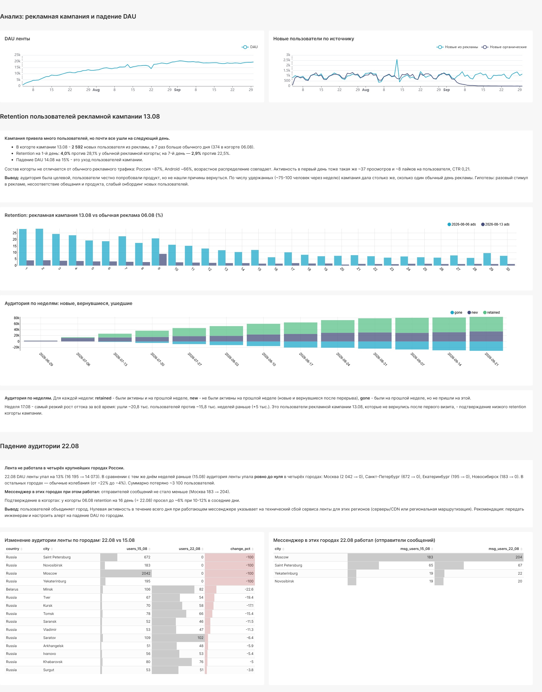

# Расследование: рекламная кампания и сбой ленты

Два события за неделю на графике DAU социального приложения: всплеск аудитории после крупной рекламной кампании и резкое падение в один из дней. Задача — понять, что стало с пользователями кампании и кто не смог воспользоваться лентой в день падения. Проект выполнен в рамках симулятора аналитика karpov.courses.

## Вопросы

1. Каков retention пользователей, привлечённых рекламной кампанией? Как часто они продолжают пользоваться приложением?
2. Какие пользователи не смогли воспользоваться лентой в день падения? Что их объединяет?

## Данные

ClickHouse, таблицы `feed_actions` (просмотры и лайки) и `message_actions` (сообщения), июль — сентябрь 2026.

## Ход анализа

**1. Находим даты событий.** Сравнение DAU каждого дня с предыдущим ([`02_dau_drops.sql`](sql/02_dau_drops.sql)) дало два самых сильных падения:

| День | DAU | Предыдущий день | Изменение |
|---|---|---|---|
| 14.08 | 14 829 | 17 452 | −15,0% |
| 22.08 | 14 073 | 16 195 | −13,1% |

По числу новых пользователей ([`01_events_by_day.sql`](sql/01_events_by_day.sql)) кампания пришлась на **13.08**: около 2,6 тыс. новых из рекламы при обычных ~1 тыс. Значит, падение 14.08 — уход пользователей кампании, а 22.08 — отдельное событие.

**2. Retention когорты кампании.** Когорту рекламных пользователей 13.08 сравниваем с рекламной когортой того же дня недели неделей раньше (06.08). Retention считается в SQL в процентах ([`03_campaign_retention.sql`](sql/03_campaign_retention.sql)), а не в тепловой карте Superset.

| | Обычная реклама 06.08 | Кампания 13.08 |
|---|---|---|
| Размер когорты | 374 | **2 592** (×7) |
| Retention, 1-й день | 28,1% | **4,0%** |
| Retention, 7-й день | 22,5% | **2,9%** |

**3. Отличается ли аудитория кампании?** ([`04_campaign_profile.sql`](sql/04_campaign_profile.sql))

| | Кампания 13.08 | Обычная реклама 06.08 |
|---|---|---|
| Доля России | 86,7% | 87,2% |
| Android | 66,3% | 68,2% |
| 18–24 года | 39,8% | 37,7% |
| Просмотров на пользователя в 1-й день | 37,1 | 39,6 |
| Лайков на пользователя в 1-й день | 7,9 | 8,5 |
| CTR в 1-й день | 0,212 | 0,216 |

Разница везде в пределах 1–2 п.п.: кампания привела ту же аудиторию, и пользователи честно попробовали продукт.

**4. Кто пропал 22.08.** Сравнение аудитории ленты по городам с тем же днём неделей раньше ([`05_outage_by_city.sql`](sql/05_outage_by_city.sql)):

| Город | 15.08 | 22.08 | Изменение |
|---|---|---|---|
| Москва | 2 042 | 0 | −100% |
| Санкт-Петербург | 672 | 0 | −100% |
| Екатеринбург | 195 | 0 | −100% |
| Новосибирск | 183 | 0 | −100% |
| Минск (следующий по падению) | 106 | 82 | −22,6% |

**5. Сломалось приложение целиком или только лента?** Мессенджер в тех же городах 22.08 работал ([`06_messenger_in_outage_cities.sql`](sql/06_messenger_in_outage_cities.sql)): Москва 183 → 204 отправителя, Санкт-Петербург 65 → 67, Екатеринбург 19 → 22, Новосибирск 19 → 20.

## Выводы

**Рекламная кампания.** Кампания привела в 7 раз больше пользователей, чем обычный день рекламы, но ~96% из них ушли уже на следующий день. Retention на 1-й день — 4,0% против 28,1% у обычной рекламной когорты. Состав аудитории и её поведение в первый день не отличаются от обычного трафика, то есть дело не в таргетинге: люди попробовали продукт и не нашли причины вернуться. По числу удержанных через неделю (~75 человек) кампания дала примерно столько же, сколько один обычный день рекламы. Гипотезы: разовый стимул в рекламе, несоответствие обещания и продукта, слабый онбординг.

**Падение 22.08.** Пользователей объединяет город: в Москве, Санкт-Петербурге, Екатеринбурге и Новосибирске аудитория ленты упала ровно до нуля на весь день (~3 100 человек), в остальных городах — обычные колебания. Мессенджер при этом работал, значит, это технический сбой сервиса ленты для этих регионов (серверы, CDN или региональная маршрутизация).

**Перекрёстные подтверждения:**
- у когорты кампании retention на 9-й день (= 22.08) подскочил до 9% при ~2,5% в соседние дни;
- у когорты 06.08 retention на 16-й день (= 22.08) просел до ~6% при 10–12% в соседние дни.

**Дополнительное наблюдение.** С начала сентября приток новых органических пользователей упал с ~600–1 200 до почти нуля в день. Это требует отдельной проверки: остановка органического канала или ошибка в разметке источника.

## Рекомендации

- Передать инженерам информацию о сбое и настроить алерт на падение DAU в разрезе городов.
- Перед следующей крупной кампанией проверить онбординг новых пользователей и соответствие рекламного обещания продукту; оценивать кампанию по удержанным пользователям, а не по установкам.
- Разобраться с исчезновением органического трафика в сентябре.

## Инструменты

ClickHouse · SQL (когортный анализ, условная агрегация `uniqExactIf`/`countIf`) · Apache Superset
