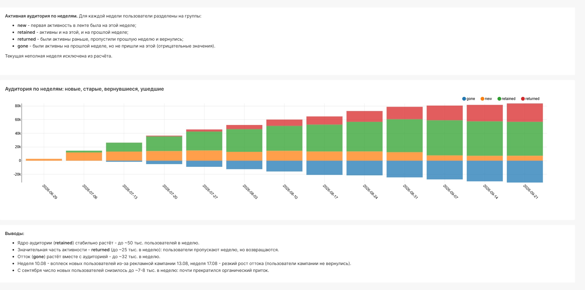

# Активная аудитория по неделям: new / retained / returned / gone

Разложение недельной активной аудитории ленты новостей на новых, оставшихся, вернувшихся и ушедших пользователей. Такой график показывает не только размер аудитории, но и за счёт чего она меняется. Проект выполнен в рамках симулятора аналитика karpov.courses.

## Определения

Для каждой недели (понедельник — воскресенье):

| Статус | Определение |
|---|---|
| **new** | первая активность в ленте была на этой неделе |
| **retained** | активен и на этой, и на прошлой неделе |
| **returned** | был активен раньше, пропустил прошлую неделю и вернулся |
| **gone** | был активен на прошлой неделе, на этой не пришёл (показывается со знаком минус) |

Текущая неполная неделя исключена из расчёта.

## Метод

Запрос — [`sql/weekly_audience.sql`](sql/weekly_audience.sql). Без оконных функций, на массивах ClickHouse:

1. Для каждого пользователя `groupUniqArray(toMonday(...))` собирает массив недель активности `weeks_visited`.
2. `arrayJoin` разворачивает массив обратно в строки: одна строка = пользователь × неделя активности.
3. **Ушедшие:** к каждой неделе активности прибавляется неделя (`addWeeks`). Если следующей недели нет в массиве (`NOT has`), на ней пользователь — ушедший.
4. **Новые, оставшиеся, вернувшиеся:** для недели активности проверяется, первая ли она (`arrayMin`) и был ли пользователь активен неделей раньше (`has`).
5. Обе части объединяются через `UNION ALL`, ушедшие умножаются на −1, чтобы на графике уходить вниз.

В базовой версии из лекции новыми считаются все, кого не было на прошлой неделе. Выделение **returned** в отдельный статус точнее соответствует определению «первая активность на этой неделе»: в сентябре по-настоящему новых ~7–8 тыс. в неделю, а не ~30 тыс.

## Выводы

- Ядро аудитории (**retained**) стабильно растёт — до ~50 тыс. пользователей в неделю.
- Заметная часть активности — **returned** (до ~25 тыс. в неделю): пользователи пропускают неделю, но возвращаются.
- Отток (**gone**) растёт вместе с аудиторией — до ~32 тыс. в неделю.
- Неделя 10.08 — всплеск новых пользователей от рекламной кампании 13.08; неделя 17.08 — самый резкий рост оттока (+5 тыс. к предыдущей неделе): пользователи кампании не вернулись. Подробно — в проекте [02](../02-campaign-and-outage-investigation/).
- С сентября число новых пользователей снизилось до ~7–8 тыс. в неделю из-за почти полной остановки органического притока, и рост аудитории замедлился.

## Инструменты

ClickHouse (`groupUniqArray`, `arrayJoin`, `has`, `addWeeks`, `arrayMin`) · SQL · Apache Superset
